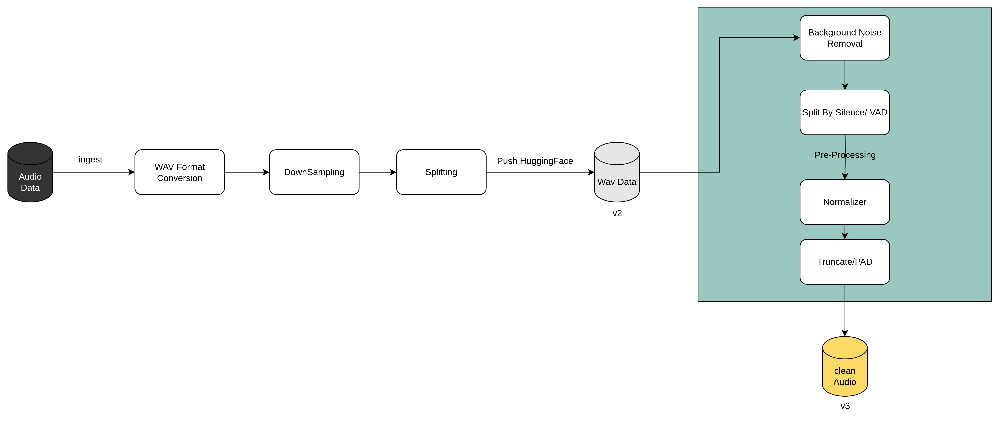
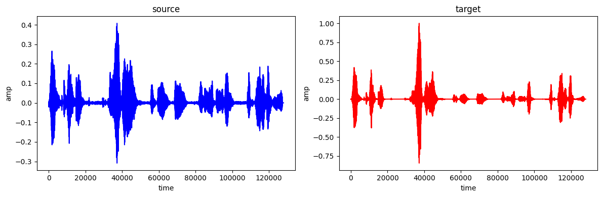
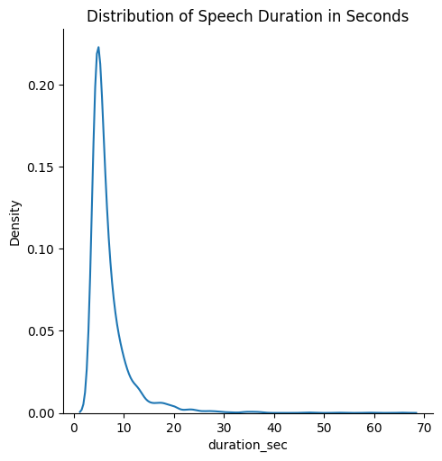
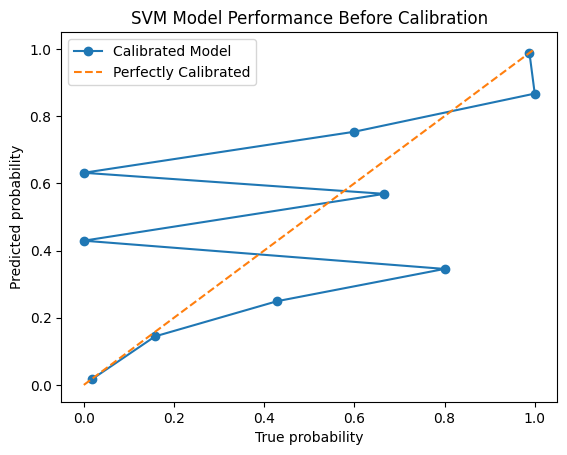
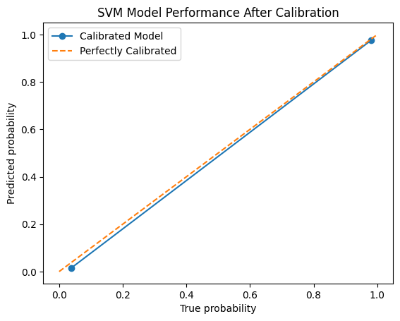

# Speechy: Voice Gender Detection System

## Overview
Speechy is an advanced system for voice gender detection, combining state-of-the-art machine learning models with classical signal processing techniques. This document details the core workflow, data pipeline, model performance, and data cleaning processes, providing a clear roadmap for development and evaluation.

## Demo
https://github.com/user-attachments/assets/3f9e2915-ac1b-4308-b08c-8bf4f7e3d0bf
## Core Workflow

### Data Pipeline
The data pipeline is designed for scalability and efficiency, transforming raw audio into model-ready features. The workflow is illustrated below:

### Gender Detection Models

#### ECAPA Pretrained Model
- **Description**: Leverages a finetuned ECAPA model pretrained on the VoxCeleb dataset, providing a robust foundation for voice gender classification.
- **Source**: Available on HuggingFace: [ECAPA Model](https://huggingface.co/JaesungHuh/voice-gender-classifier).
- **Contribution**: Streamlined integration into the pipeline for seamless deployment and rapid prototyping.
- **Next Steps**: Optimize model inference speed and explore transfer learning for domain-specific datasets.

#### Classical Approach
- **Status**: Planned for implementation.
- **Approach**: Utilize classical signal processing techniques, such as pitch analysis and formant frequency extraction, to detect gender-specific vocal characteristics.
- **Reference**: [Voice Gender Detection Repository](https://github.com/jim-schwoebel/voice_gender_detection/tree/master).
- **Next Steps**: Implement pitch-based and formant-based features, then evaluate performance against the ECAPA model on a standardized test set.

#### Hybrid Approach
- **Status**: Planned for development.
- **Approach**: Combine the ECAPA model’s deep learning capabilities with classical features (e.g., pitch, formants) to create a hybrid model, potentially improving robustness and generalization.
- **Next Steps**: Develop a fusion mechanism (e.g., feature concatenation or ensemble learning) and compare performance against standalone models using metrics like accuracy, F1 score, and inference time.

## Data Cleaning

### Evaluation Metric: DNSMOS
The **Deep Noise Suppression Mean Opinion Score (DNSMOS)** is a non-intrusive perceptual metric based on the **ITU-T P.835** and **P.808** frameworks, used to assess audio quality after noise suppression. It provides four key scores:

1. **p808_mos**: Overall audio quality (1–5), reflecting the general listening experience.
2. **mos_sig**: Speech clarity (1–5), evaluating intelligibility and absence of distortions (PCC: 0.94).
3. **mos_bak**: Background noise quality (1–5), assessing noise suppression effectiveness (PCC: 0.98).
4. **mos_ovr**: Combined speech and noise quality (1–5), providing a holistic quality score (PCC: 0.98).

These metrics ensure robust evaluation of noise suppression algorithms, critical for preparing clean audio inputs for gender detection.

### Example of Cleaned Data

### Training Data Duration Distribution

**Observations**:
- The distribution is right-skewed, with most speech segments lasting 1–10 seconds.
- A sharp peak occurs at 3–4 seconds, indicating predominantly short utterances.
- A long tail extends to ~70 seconds, representing rare longer segments.
- **Implication**: Short-segment dominance suggests models should be optimized for brief audio clips, with potential preprocessing for longer segments to ensure consistency.

## 🔍 Model Performance Comparison

| Model                          | Accuracy | F1 Score | Precision | Recall | ROC AUC | Log Loss |
|-------------------------------|----------|----------|-----------|--------|---------|----------|
| **SVC**                       | 0.9755   | 0.9766   | 0.9725    | 0.9806 | N/A     | N/A      |
| **LogisticRegressionCV**      | 0.9741   | 0.9752   | 0.9699    | 0.9806 | 0.9850  | 0.1334   |
| **QuadraticDiscriminantAnalysis** | 0.9741 | 0.9752   | 0.9699    | 0.9806 | 0.9832  | 0.7870   |
| **RidgeClassifier**           | 0.9698   | 0.9710   | 0.9670    | 0.9751 | N/A     | N/A      |
| **RidgeClassifierCV**         | 0.9698   | 0.9710   | 0.9670    | 0.9751 | N/A     | N/A      |

**Notes**:
- All scores are based on the validation set.
- `ROC AUC` and `Log Loss` are unavailable for models without `predict_proba` (e.g., SVC, RidgeClassifier).
- **Key Insight**: SVC outperforms others in accuracy and F1 score, while LogisticRegressionCV excels in ROC AUC and Log Loss, indicating strong probabilistic predictions.

---

### ✅ Final Model Selection

We selected **SVC** as the final classifier based on its superior accuracy and F1 score. The model was tested on the held-out test set and achieved performance consistent with validation (≈ 0.970), demonstrating strong generalization.

However, SVC does **not** produce calibrated probabilities by default. This is crucial for applications where confidence scores matter (e.g., threshold tuning, model stacking, uncertainty-based filtering). To address this, we calibrated the model using **isotonic regression**, enabling reliable probabilistic outputs.

---

### 📈 Calibration Results

| Before Calibration                            | After Calibration                             |
|-----------------------------------------------|-----------------------------------------------|
|  |   |

- **Before Calibration**: Predicted probabilities deviate significantly from true probabilities.
- **After Calibration**: The model's predicted probabilities align closely with the ideal diagonal (perfect calibration).

This confirms the effectiveness of the calibration step and readiness of the SVC model for production use.

---

### 🔧 Calibration Details

- **Method**: Isotonic Regression (via `CalibratedClassifierCV`)
- **Cross-validation**: 5-fold on training data
- **Use Case**: Improves reliability of probability scores for downstream decision-making
