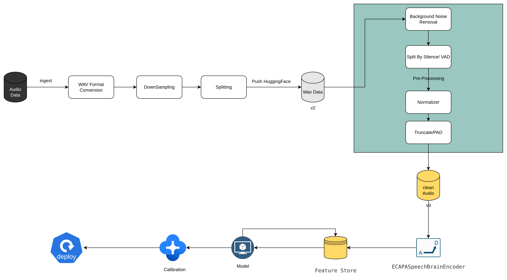

# Speechy: Voice Gender Detection System

## Overview

Speechy is an audio processing pipeline designed to detect speech and identify the speaker's gender in WAV files, addressing challenges like background noise, long silences, sudden volume changes, and inconsistent lengths. It uses the pre-trained Silero VAD for voice activity detection , a ECAPA SpeechBrain encoder for feature extraction and a classification head of trained ML model (classical approach), with custom preprocessing implemented using Python libraries like Librosa and SoundFile.

---

## Table of Contents

- Features
- Installation
- Usage
- Workflow
- Model Performance
- Data Cleaning
- Dataset


## Features

- **Speech Detection**: Identifies speech segments using Silero VAD, removing silences.
- **Gender Classification**: Uses ECAPA SpeechBrain encoder and a calibrated SVC model to determine gender.
- **Robust Preprocessing**: Handles background noise, volume variations, and audio length inconsistencies.
- **Scalable Pipeline**: Processes audio from ingestion to feature extraction efficiently.
- **Deployment**: expose the sytem as a webservice 


**Prerequisites:**
- uv 

```bash
# Clone the repository
git clone https://github.com/ahmedelsayed968/Speechy.git
# Navigate to the project directory
cd speechy
# copy all creds to .env file
cp .env.example .env # set the correct values for each key
# populate the venv
uv venv
# activate the env
source ./.venv/bin/activate  # On Windows: .venv\Scripts\activate
# Install dependencies
uv sync
# build the project
uv pip install -e .
```

## Usage

run the server
```bash
uv run uvicorn src.api.app:app
```
run the streamlit application
```bash
streamlit run /kaggle/working/Speechy/src/frontend/app.py 
```
enjoy playing with Speechy 😉

## Demo
https://github.com/user-attachments/assets/3f9e2915-ac1b-4308-b08c-8bf4f7e3d0bf
## Core Workflow
The following diagram outlines the end-to-end architecture for building a voice-based gender classification system using classical and deep learning approaches:


### 📥 Data Ingestion and Preparation

1. **Audio Data**: Raw audio files are ingested into the pipeline.
2. **WAV Format Conversion**: Converts input files into `.wav` format for consistent processing.
3. **DownSampling**: Reduce the number of male audio files to balance the dataset
4. **Splitting**: The dataset is divided into training, validation, and testing subsets.
5. **Push to Hugging Face**: Processed data is versioned and uploaded to the Hugging Face Hub for accessibility and reproducibility (`v2`).

### 🔧 Preprocessing Pipeline

After downloading the dataset:
- **Background Noise Removal**: Applies noise suppression techniques (e.g., spectral subtraction, denoising).
- **Split by Silence / VAD**: Uses Voice Activity Detection to remove silent segments and improve model focus on speech content.
- **Normalizer**: Standardizes audio amplitude or loudness to ensure consistency across samples.
- **Truncate/PAD**: Ensures all audio samples meet a fixed duration by trimming or zero-padding.

The result is stored as a cleaned and preprocessed version of the audio dataset (`v3`).

### 🧠 Feature Extraction

- **ECAPA SpeechBrain Encoder**: Transforms clean audio into robust speaker embeddings, which are stored in the **Feature Store**.

### 🧪 Model Training and Calibration

- **Model**: Various ML classifiers are trained using extracted features (Classical estimators).
- **Calibration**: Improves probability estimates using techniques such as isotonic regression or Platt scaling.
- **Deploy**: The final calibrated model is deployed as a production-ready service.


### Gender Detection Models


## ✅ Cleaning Techniques Addressed:
- **Background Noise**: Removed using spectral subtraction.
- **Long Silences**: Filtered via Silero VAD.
- **Volume Variations**: Normalized with peak amplitude scaling and loudness normalizer
- **Inconsistent Lengths**: Truncated or padded to bsaed on a threshold infered from training set equal to `11.264`.

### 📈 Evaluation Metric: DNSMOS

To evaluate how clean the audio is after processing, the **Deep Noise Suppression Mean Opinion Score (DNSMOS)** is used. It is a non-intrusive, perceptual audio quality metric inspired by **ITU-T P.835** and **P.808** standards, and provides four key scores:

1. **p808_mos**: Overall audio quality (1–5) – reflects general listening quality.
2. **mos_sig**: Speech quality (1–5) – evaluates clarity and distortion (PCC ≈ 0.94).
3. **mos_bak**: Background noise score (1–5) – assesses noise suppression success (PCC ≈ 0.98).
4. **mos_ovr**: Overall signal score (1–5) – combines speech and noise quality (PCC ≈ 0.98).

These scores are used as a proxy to validate the effectiveness of preprocessing and help ensure high-quality audio for gender classification.


### Example of Cleaned Data
The following figure compares a raw audio waveform (**source**) with its cleaned version (**target**) after applying noise suppression and normalization:


#### 🔬 DNSMOS Quality Comparison

| Metric      | Source | Target | Δ Change | Observation |
|-------------|--------|--------|----------|-------------|
| **p808_mos**| 3.40   | 3.39   | -0.01    | Minor change; overall perceptual quality preserved |
| **sig_mos** | 3.47   | 3.25   | -0.22    | Slight drop in speech clarity, possibly due to aggressive suppression |
| **bak_mos** | 3.47   | 4.11   | +0.64    | Significant improvement in background noise reduction |
| **ovrl_mos**| 2.90   | 3.02   | +0.12    | Overall perceived quality slightly improved |

#### 🧠 Key Insights

- **Background Noise** was successfully suppressed, as evidenced by a **+0.64 increase** in `bak_mos`.
- **Speech Clarity** (`sig_mos`) experienced a minor decline, likely due to some speech distortion during noise suppression.
- **Overall Quality** (`ovrl_mos`) showed a **net improvement**, suggesting that the trade-off between clarity and cleanliness was favorable.
- The waveform plot shows reduced amplitude and silence padding in the target, reflecting **VAD** and **normalization effects**.

This analysis validates the **effectiveness of the preprocessing pipeline**, especially in denoising while maintaining usable speech quality for downstream tasks like gender classification.

### 🔊 Listen to Audio Samples

**Source (Raw)**  

https://github.com/user-attachments/assets/0137d589-0ad3-4323-94c3-171ce2526658


**Target (Cleaned)**  


https://github.com/user-attachments/assets/29e4ec4e-8ef4-4dac-b5c8-c307196770f6


### Training Data Duration Distribution


**Observations**:
- The distribution is right-skewed, with most speech segments lasting 1–10 seconds.
- A sharp peak occurs at 3–4 seconds, indicating predominantly short utterances.
- A long tail extends to ~70 seconds, representing rare longer segments.
- **Implication**: Short-segment dominance suggests models should be optimized for brief audio clips, with potential preprocessing for longer segments to ensure consistency.

## 🔍 Model Performance Comparison

| Model                          | Accuracy | F1 Score | Precision | Recall | ROC AUC | Log Loss |
|-------------------------------|----------|----------|-----------|--------|---------|----------|
| **SVC**                       | 0.9755   | 0.9766   | 0.9725    | 0.9806 | N/A     | N/A      |
| **LogisticRegressionCV**      | 0.9741   | 0.9752   | 0.9699    | 0.9806 | 0.9850  | 0.1334   |
| **QuadraticDiscriminantAnalysis** | 0.9741 | 0.9752   | 0.9699    | 0.9806 | 0.9832  | 0.7870   |
| **RidgeClassifier**           | 0.9698   | 0.9710   | 0.9670    | 0.9751 | N/A     | N/A      |
| **RidgeClassifierCV**         | 0.9698   | 0.9710   | 0.9670    | 0.9751 | N/A     | N/A      |


**Notes**:
- All scores are based on the validation set.
- `ROC AUC` and `Log Loss` are unavailable for models without `predict_proba` (e.g., SVC, RidgeClassifier).
- **Key Insight**: SVC outperforms others in accuracy and F1 score, while LogisticRegressionCV excels in ROC AUC and Log Loss, indicating strong probabilistic predictions.

### 📊 Experiment Tracking with Weights & Biases

All training and evaluation runs were tracked using **[WandB](https://wandb.ai/)** to monitor performance, compare models, and visualize training metrics in real time.

> 🔗 [Click here to view the full experiment dashboard on WandB](https://wandb.ai/Minds-Team/Speechy?nw=nwuserahmedeltop968)

### ✅ Final Model Selection

I selected **SVC** as the final classifier based on its superior accuracy and F1 score. The model was tested on the held-out test set and achieved performance consistent with validation (≈ 0.970), demonstrating strong generalization.

However, SVC does **not** produce calibrated probabilities by default. This is crucial for applications where confidence scores matter (e.g., threshold tuning, model stacking, uncertainty-based filtering). To address this, we calibrated the model using **isotonic regression**, enabling reliable probabilistic outputs.

---

### 📈 Calibration Results

| Before Calibration                            | After Calibration                             |
|-----------------------------------------------|-----------------------------------------------|
|  |   |

- **Before Calibration**: Predicted probabilities deviate significantly from true probabilities.
- **After Calibration**: The model's predicted probabilities align closely with the ideal diagonal (perfect calibration).

This confirms the effectiveness of the calibration step and readiness of the SVC model for production use.

---

### 🔧 Calibration Details

- **Method**: Isotonic Regression (via `CalibratedClassifierCV`)
- **Cross-validation**: 5-fold on training data
- **Use Case**: Improves reliability of probability scores for downstream decision-making

## 📂 Dataset

The dataset used in this project is publicly available:

- **Google Drive**: Contains the **raw version** of the dataset.
- **Hugging Face Hub**: Hosts a **cleaned and preprocessed version** of the dataset, ready for direct use in model training and experimentation.

> 🔗 [View Dataset on Hugging Face](https://huggingface.co/datasets/ahmedelsayed/VoxCeleb-Gender)

Additionally, **Hugging Face** was used as a **feature store** to persist and version the extracted **ECAPA embeddings**, making it easy to share and reuse features across different training runs and model comparisons.
